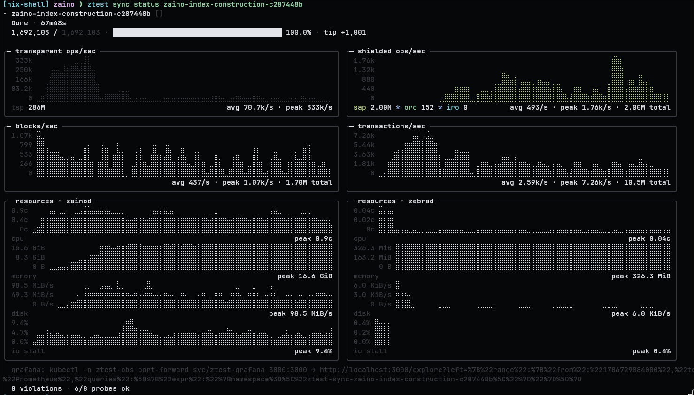
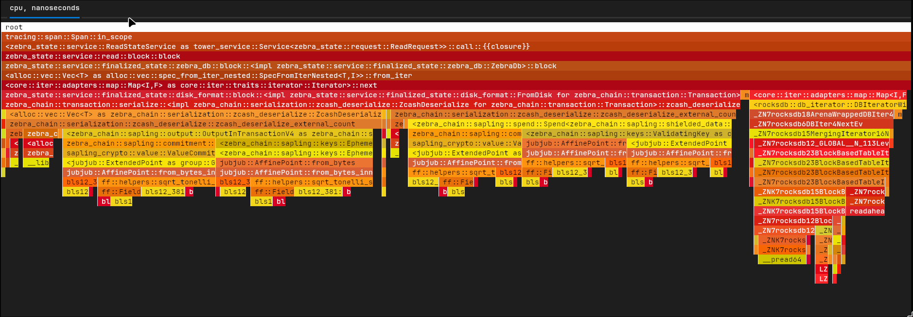

# ztest

Boot Zcash topologies (validators, indexers, wallets) on Kubernetes and
hand **typed RPC handles** back to test code.

### Quickstart

```sh
kind create cluster
ztest cluster add kind --kind kind --set-default
ztest cluster setup

# Run integration tests against validator/indexer pods
ztest run

# Launch long-running background syncs
ztest sync start zaino-index-construction
```

## Integration Test Usage

```rust
use ztest::prelude::*;

#[tokio::test(flavor = "multi_thread")]
async fn zaino_indexes_to_validator_tip() {
    let mut t = TestEnv::builder();
    let zebra = t.add_validator(Validator::zebrad("6.2.3").regtest());
    let zaino = t.add_indexer(Indexer::zainod("0.7.0").regtest());
    t.build().await.unwrap();

    // Typed RPC sugar on the validator handle:
    zebra.generate_blocks(10).await.unwrap();
    zaino.poll_block_height(zebra.chain_height().await.unwrap())
        .await
        .unwrap();
}
```

most operations are defined by generic traits (`ValidatorBackend`,
`IndexerBackend`,`WalletBackend`) making ztest backend-agnostic.

### In-process wallet

Wallets are primarily run in-process, and most do not ship a daemon docker
container, so test-runner images are used and sized w/ more CPU.

```rust
use ztest::WalletConfig;
use ztest::prelude::*;

#[rstest::rstest]
#[case::librustzcash(Wallet::librustzcash())]
#[case::zallet(Wallet::zallet())]
#[tokio::test(flavor = "multi_thread")]
#[ztest::qos::wallet]
async fn ironwood_fetch_parity<B>(#[case] wallet: Wallet<B>)
where
    B: WalletConfig,
    B::Handle: WalletExt,
{
    let mut t = TestEnv::builder();
    let zebra = t.add_validator(Validator::zebrad("6.2.3").regtest());
    let zaino = t.add_indexer(Indexer::zaino("0.7.0").regtest());
    let wallet = t.add_wallet(wallet);
    t.build().await.unwrap();

    let faucet = wallet.funded_faucet(&zebra, &zaino).await.unwrap();
    let recipient = wallet.recipient(&zebra, &zaino).await.unwrap();
    let to = recipient.address(Pool::Orchard).await.unwrap();
    faucet.send(&to, 100_000).await.unwrap();
}
```

Each `#[case]` is a distinct wallet *type* (`Wallet<LrzBackend>`, …), so the
body is generic over the backend and
`WalletExt` supplies the well-known seeds, funded faucet and recipient for every
one of them. `ztest run` names the cases
`ironwood_fetch_parity::case_1_librustzcash`, … and each inherits the tier
declared on the parent fn.

`Wallet::zallet()` is not implemented yet — drop that case until the zallet
backend lands.

### Mount a custom config and a seeded data dir

```rust
let zebra = t.add_validator(
    Validator::zebrad("6.2.3")
        .mount(mount_config! ("tests/assets/zebrad.toml",              "/etc/zebrad/zebrad.toml"))
        .mount(mount_archive!("tests/assets/zebrad-100blocks.tar.zst", "/data")),
    );
);

// Ztest also currently has zebra chain archives for mainnet and testnet (will add more later)
let zebra = t.add_validator(
    Validator::zebrad("6.2.3").mainnet("orchard")
);

```

### Dev images

When iterating on a component locally, swap the published constructor for
a `dev!(...)` pointed at a `Dockerfile` (resolved relative to the test
crate; compile fails if missing):

```rust
let zai = t.add_indexer(dev!(Indexer::Zainod, "../Dockerfile"));
```

Accepted variants: `Validator::Zebrad`, `Validator::Zcashd`,
`Indexer::Zainod`, `Wallet::librustzcash`.

## Long-running syncs

Multi-hour sync workloads run as their own pod-backed lifecycle, detached from
the terminal that started them. `ztest sync status` renders the report —
throughput by pool, block/tx rates, and per-component CPU, memory, disk and IO
stall — from the same series Grafana serves:

```sh
ztest sync start zaino-index-construction

# blk/s tx/s, operations/s
ztest sync status zaino-index-construction-c287448b

# Launches flamegraph viz frontend
ztest sync perf zaino-index-construction-c287448b --component zainod
```




## CLI

The `ztest` binary is the developer entry point for running ztest-managed
integration tests:

```sh
cargo run --bin ztest -- --help
```

## TODO

- [ ] Review config rendering path (Use rust structs instead of toml? How to handle version matrix w/ config migrations?) -> Put this into a trait?

  - That way zaino developers can define the function to generate the config toml based on the version? Need a clear example of how this would look

- [ ] Migrate src/backends/zainod.rs to src/backends/zainod/{config,backend,sync}.rs
