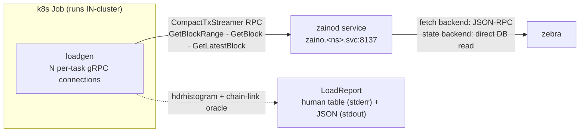

# loadgen

A concurrency/load generator for a **running** zainod. It attaches to a zainod's
gRPC `CompactTxStreamer` endpoint, fans out N concurrent clients driving a chosen
RPC, and reports real latency percentiles, throughput, error counts, and
correctness violations.

Unlike the rest of ztest it does **not** spawn a topology — it points at an
endpoint you give it (`--target`). The same binary loads a regtest node on a
laptop or a mainnet node in-cluster, and runs as a plain Kubernetes Job.

## Architecture



It reuses `ztest::loadtest` (the `LwdClient` / `LoadDriver` / `ChainLinkOracle` /
`LoadReport` stack); this crate is the runnable front-end. Three seams are kept
independent:

- **driver** — the swarm + metrics (`ztest::loadtest`), speaks only the gRPC wire
  protocol, so it is version- and target-agnostic.
- **target** — supplied as a URI; how the zainod got there (regtest spawn,
  ephemeral deploy, mainnet) is not loadgen's concern.
- **reporting** — a human table on stderr and a machine-readable JSON summary on
  stdout (`--json`).

## Running

### Locally (against any reachable endpoint)

```
cargo run -p loadgen -- \
    --target http://127.0.0.1:8137 \
    --rpc block-range --connections 64 --duration 30 --json
```

### In-cluster (the representative path)

Latency is only meaningful measured **inside** the cluster — a port-forward from a
remote node would dominate the numbers. Run it as a Job in the target namespace;
the target is derived from the pod's own namespace:

```
kubectl -n <zaino-namespace> apply -f crates/loadgen/k8s/job.yaml
kubectl -n <zaino-namespace> logs -f job/loadgen
```

### Connection sweep (find the knee)

`scripts/sweep.sh` runs a sequential connection sweep (one Job per level — never
parallel, which would confound the measurement) and collects one JSON line per
level:

```
scripts/sweep.sh <zaino-namespace> "1 4 8 16 32 64 128" 20
```

## Flags

| flag | default | meaning |
|---|---|---|
| `--target` | (required) | zainod gRPC endpoint, e.g. `http://zaino.ns.svc:8137` |
| `--rpc` | `block-range` | `block-range` \| `latest-block` \| `block` |
| `--connections` | 64 | concurrent connections (each a spawned task) |
| `--conn-mode` | `per-task` | `per-task` (socket per client) or `shared` (one multiplexed channel) |
| `--range` | — | `START..END`; either side may be empty (`a..` = to tip, `..b` = from genesis) |
| `--tip-window` | 50000 | when `--range` is absent, sweep the last N blocks below the discovered tip |
| `--blocks` | 100 | blocks per `GetBlockRange` window |
| `--dist` | `even` | how windows spread across the pool (`even` \| `scatter`) |
| `--duration` / `--count` | 30s | run for D seconds, or N ops per connection |
| `--no-oracle` | off | disable the chain-link correctness oracle |
| `--json` | off | emit the JSON summary to stdout |

## Output

- **Human table → stderr** (via `ztest::loadtest::LoadReport::print`).
- **JSON summary → stdout** with `--json`: per-op `p50/p90/p99/p99.9/max` (ms),
  throughput, total ops, error count, and any correctness violations.
- **Logs** — structured `tracing` (set `ZTEST_LOG=loadgen=info,ztest=info`).

The **chain-link oracle** validates every response under load: blocks must link
(`prev_hash == prior.hash`), heights strictly increase, genesis is well-formed.
It adapts per RPC — it validates single blocks for `GetBlock` and is skipped for
the block-less `GetLatestBlock`. `0 violations` means every block served under
load was a correctly-linked chain segment, not just that the server was fast.

## Reproducibility & caveats

- The container image (`zingodevops/loadgen`) pins the exact binary; the committed
  `k8s/job.yaml` pins the exact args. A run is `kubectl apply` + read the logs.
- Results are a **measurement, not a calibrated SLO**: absolute latency is only
  trustworthy on a CPU-pinned, I/O-calibrated node. Trust the *shapes* (saturation,
  tail knee, collapse) and the differential (backend/version A/B), not raw absolutes.
- Target zainod should run with a **real finalised state** (not
  `ZAINO_EPHEMERAL_FINALISED_STATE`, which inflates read performance).
